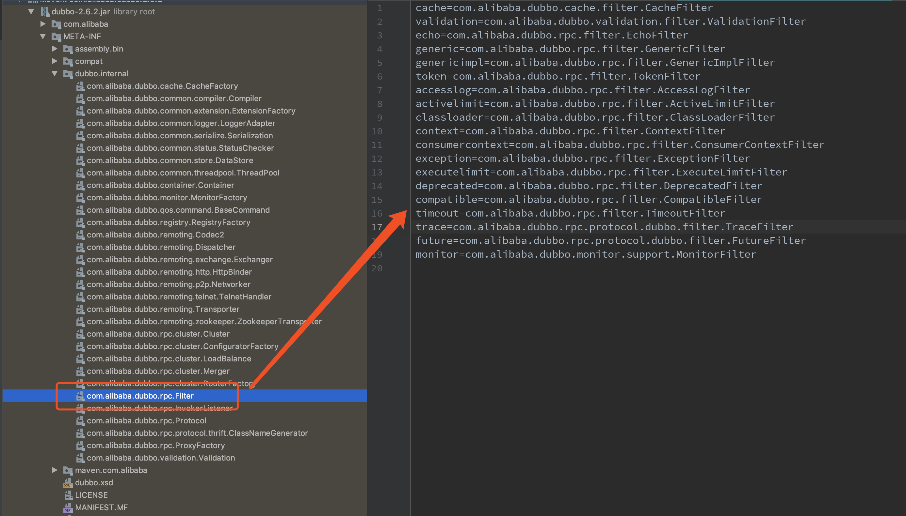
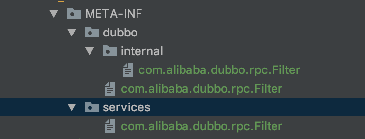

## SPI

SPI是一种扩展机制，在java中SPI机制被广泛应用，比如Spring中的SpringServletContainerInitializer 使得容器启动的时候SpringServletContainerInitializer 执行onStartup方法。在dubbo中，dubbo实现了自己的spi扩展机制，下面详细的讲解下，dubbo的扩展机制。


## dubbo SPI使用-Filter的定义使用

 dubbo中的fiter是使用spi机制实现的典型应用，现在使用filter作为例子，展示先dubbo的spi机制。

首先定义一个filter。

```java
public class MyFilter implements Filter {

  public Result invoke(Invoker<?> invoker, Invocation invocation)
      throws RpcException {
    System.out.println("开始调用 MyFilter");
    Result result = invoker.invoke(invocation);
    System.out.println("结束调用 MyFilter");
    return result;
  }
}
```

将filter加到dubbo默认的filter

```java
@Activate(group = {Constants.CONSUMER})
```

### 在消费端使用filter

在消费者的resource文件下建

 /META-INF/dubbo/internal/com.alibaba.dubbo.rpc.Filter

内容为：

```properties
myFilter=com.lenny.sample.dubbo.common.filter.MyFilter
```

在消费端指定filter

```java
@Reference(version = "1.0.0",filter = "myFilter")
private UserDubboService userDubboService;
```

在调用userDubboService的服务器时在控制台打印如下内容：


### 在服务端使用filter

在服务端的resource文件下建

 /META-INF/dubbo/internal/com.alibaba.dubbo.rpc.Filter

内容为：

```properties
myFilter=com.lenny.sample.dubbo.common.filter.MyFilter
```

在服务提供者指定filter：

```java
@Service(version = "1.0.0",filter = "myFilter")
```

同样在控制台打印如下内容：


## dubbo默认filter

dubbo默认提供一些filter。




## dubbo filter源码分析

Filter的加载源码位于ProtocolFilterWrapper类，具体实现过程

```java

// 服务端暴露
@Override
public <T> Exporter<T> export(Invoker<T> invoker) throws RpcException {
    if (Constants.REGISTRY_PROTOCOL.equals(invoker.getUrl().getProtocol())) {
        return protocol.export(invoker);
    }
    return protocol.export(buildInvokerChain(invoker, Constants.SERVICE_FILTER_KEY, Constants.PROVIDER));
}

// 消费端
@Override
public <T> Invoker<T> refer(Class<T> type, URL url) throws RpcException {
    if (Constants.REGISTRY_PROTOCOL.equals(url.getProtocol())) {
        return protocol.refer(type, url);
    }
    return buildInvokerChain(protocol.refer(type, url), Constants.REFERENCE_FILTER_KEY, Constants.CONSUMER);
}
```

主要看buildInvokerChain。

```java
private static <T> Invoker<T> buildInvokerChain(final Invoker<T> invoker, String key, String group) {
        Invoker<T> last = invoker;
    // 获取全部的filter
        List<Filter> filters = ExtensionLoader.getExtensionLoader(Filter.class).getActivateExtension(invoker.getUrl(), key, group);
        if (!filters.isEmpty()) {
            for (int i = filters.size() - 1; i >= 0; i--) {
                final Filter filter = filters.get(i);
                final Invoker<T> next = last;
                last = new Invoker<T>() {
                    @Override
                    public Class<T> getInterface() {
                        return invoker.getInterface();
                    }
                    @Override
                    public URL getUrl() {
                        return invoker.getUrl();
                    }
                    @Override
                    public boolean isAvailable() {
                        return invoker.isAvailable();
                    }

                    @Override
                    public Result invoke(Invocation invocation) throws RpcException {
                        // 执行filter的invoke方法
                        return filter.invoke(next, invocation);
                    }

                    @Override
                    public void destroy() {
                        invoker.destroy();
                    }

                    @Override
                    public String toString() {
                        return invoker.toString();
                    }
                };
            }
        }
        return last;
    }
```

在执行export的时候获取全部的filter，绑定到要执行的方法上面，在要执行的方面的时候，执行filter方法。


## Spi的加载原理

在ExtensionLoader中有loadExtensionClasses方法，加载全部的扩展类。

```java
private static final String SERVICES_DIRECTORY = "META-INF/services/";
private static final String DUBBO_DIRECTORY = "META-INF/dubbo/";
private static final String DUBBO_INTERNAL_DIRECTORY = DUBBO_DIRECTORY + "internal/";
private static final Pattern NAME_SEPARATOR = Pattern.compile("\\s*[,]+\\s*");

private Map<String, Class<?>> loadExtensionClasses() {
     final SPI defaultAnnotation = type.getAnnotation(SPI.class);
     if (defaultAnnotation != null) {
         String value = defaultAnnotation.value();
         if ((value = value.trim()).length() > 0) {
             String[] names = NAME_SEPARATOR.split(value);
             if (names.length > 1) {
                 throw new IllegalStateException("more than 1 default extension name on extension " + type.getName()
                                                 + ": " + Arrays.toString(names));
             }
             if (names.length == 1) cachedDefaultName = names[0];
         }
     }

     Map<String, Class<?>> extensionClasses = new HashMap<String, Class<?>>();
     // 去相应的文件路径下扫描文件
     loadDirectory(extensionClasses, DUBBO_INTERNAL_DIRECTORY);
     loadDirectory(extensionClasses, DUBBO_DIRECTORY);
     loadDirectory(extensionClasses, SERVICES_DIRECTORY);
     return extensionClasses;
 }
```

```java
private void loadDirectory(Map<String, Class<?>> extensionClasses, String dir) {
    // 文件路径加上全类名
        String fileName = dir + type.getName();
    try {
        Enumeration<java.net.URL> urls;
        ClassLoader classLoader = findClassLoader();
        if (classLoader != null) {
            urls = classLoader.getResources(fileName);
        } else {
            urls = ClassLoader.getSystemResources(fileName);
        }
        if (urls != null) {
            while (urls.hasMoreElements()) {
                java.net.URL resourceURL = urls.nextElement();
                // 加载资源文件
                loadResource(extensionClasses, classLoader, resourceURL);
            }
        }
    } catch (Throwable t) {
        logger.error("Exception when load extension class(interface: " +
                     type + ", description file: " + fileName + ").", t);
    }
}
```

根据使用@SPI的注解的类全类名去如下路径，找到相应问文件，解析文件内容

- META-INF/dubbo/internal/全类名
- META-INF/dubbo/全类名
- META-INF/services/全类名

如以filter为例：

```java
package com.alibaba.dubbo.rpc;
import com.alibaba.dubbo.common.extension.SPI;

@SPI
public interface Filter {
    Result invoke(Invoker<?> invoker, Invocation invocation) throws RpcException;
}
```

Filter的全类名是com.alibaba.dubbo.rpc.Filter。所以可以去扫描如下路径

- META-INF/dubbo/internal/com.alibaba.dubbo.rpc.Filter

- META-INF/dubbo/com.alibaba.dubbo.rpc.Filter
- META-INF/services/com.alibaba.dubbo.rpc.Filter

在上面的例子中将MyFilter的文件定义到了META-INF/dubbo/internal/com.alibaba.dubbo.rpc.Filter路径下。

当然也可以放到META-INF/dubbo/com.alibaba.dubbo.rpc.Filter和META-INF/services/com.alibaba.dubbo.rpc.Filter。

如图：放到下面三个位置任何一个位置都是可以的。




本文源代码：https://github.com/applenele/sample

