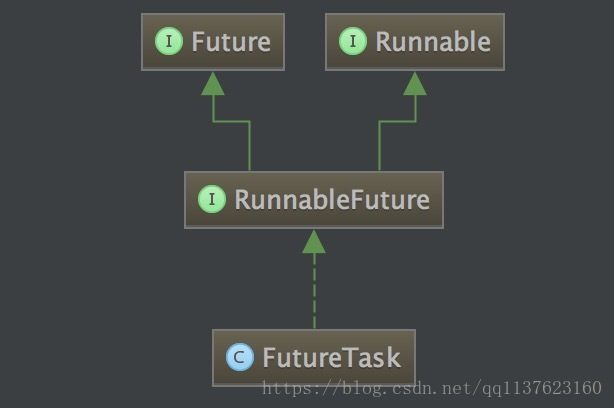

## 场景

先上一个场景：假如你突然想做饭，但是没有厨具，也没有食材。网上购买厨具比较方便，食材去超市买更放心。

实现分析：在快递员送厨具的期间，我们肯定不会闲着，可以去超市买食材。所以，在主线程里面另起一个子线程去网购厨具。

但是，子线程执行的结果是要返回厨具的，而run方法是没有返回值的。所以，这才是难点，需要好好考虑一下。

模拟代码1：

```java
package test;

public class CommonCook {

    public static void main(String[] args) throws InterruptedException {
        long startTime = System.currentTimeMillis();
        // 第一步 网购厨具
        OnlineShopping thread = new OnlineShopping();
        thread.start();
        thread.join();  // 保证厨具送到
        // 第二步 去超市购买食材
        Thread.sleep(2000);  // 模拟购买食材时间
        Shicai shicai = new Shicai();
        System.out.println("第二步：食材到位");
        // 第三步 用厨具烹饪食材
        System.out.println("第三步：开始展现厨艺");
        cook(thread.chuju, shicai);
        
        System.out.println("总共用时" + (System.currentTimeMillis() - startTime) + "ms");
    }
    
    // 网购厨具线程
    static class OnlineShopping extends Thread {
        
        private Chuju chuju;

        @Override
        public void run() {
            System.out.println("第一步：下单");
            System.out.println("第一步：等待送货");
            try {
                Thread.sleep(5000);  // 模拟送货时间
            } catch (InterruptedException e) {
                e.printStackTrace();
            }
            System.out.println("第一步：快递送到");
            chuju = new Chuju();
        }
        
    }

    //  用厨具烹饪食材
    static void cook(Chuju chuju, Shicai shicai) {}
    
    // 厨具类
    static class Chuju {}
    
    // 食材类
    static class Shicai {}
}
```

运行结果：

```
第一步：下单
第一步：等待送货
第一步：快递送到
第二步：食材到位
第三步：开始展现厨艺
总共用时7013ms
```

可以看到，多线程已经失去了意义。在厨具送到期间，我们不能干任何事。对应代码，就是调用join方法阻塞主线程。

有人问了，不阻塞主线程行不行？？？

不行！！！

从代码来看的话，run方法不执行完，属性chuju就没有被赋值，还是null。换句话说，没有厨具，怎么做饭。

Java现在的多线程机制，核心方法run是没有返回值的；如果要保存run方法里面的计算结果，必须等待run方法计算完，无论计算过程多么耗时。

面对这种尴尬的处境，程序员就会想：在子线程run方法计算的期间，能不能在主线程里面继续异步执行？？？

Where there is a will，there is a way！！！

这种想法的核心就是Future模式，下面先应用一下Java自己实现的Future模式。

模拟代码2：

```java
package test;

import java.util.concurrent.Callable;
import java.util.concurrent.ExecutionException;
import java.util.concurrent.FutureTask;

public class FutureCook {

    public static void main(String[] args) throws InterruptedException, ExecutionException {
        long startTime = System.currentTimeMillis();
        // 第一步 网购厨具
        Callable<Chuju> onlineShopping = new Callable<Chuju>() {

            @Override
            public Chuju call() throws Exception {
                System.out.println("第一步：下单");
                System.out.println("第一步：等待送货");
                Thread.sleep(5000);  // 模拟送货时间
                System.out.println("第一步：快递送到");
                return new Chuju();
            }
            
        };
        FutureTask<Chuju> task = new FutureTask<Chuju>(onlineShopping);
        new Thread(task).start();
        // 第二步 去超市购买食材
        Thread.sleep(2000);  // 模拟购买食材时间
        Shicai shicai = new Shicai();
        System.out.println("第二步：食材到位");
        // 第三步 用厨具烹饪食材
        if (!task.isDone()) {  // 联系快递员，询问是否到货
            System.out.println("第三步：厨具还没到，心情好就等着（心情不好就调用cancel方法取消订单）");
        }
        Chuju chuju = task.get();
        System.out.println("第三步：厨具到位，开始展现厨艺");
        cook(chuju, shicai);
        
        System.out.println("总共用时" + (System.currentTimeMillis() - startTime) + "ms");
    }
    
    //  用厨具烹饪食材
    static void cook(Chuju chuju, Shicai shicai) {}
    
    // 厨具类
    static class Chuju {}
    
    // 食材类
    static class Shicai {}

}
```

运行结果：

```
第一步：下单
第一步：等待送货
第二步：食材到位
第三步：厨具还没到，心情好就等着（心情不好就调用cancel方法取消订单）
第一步：快递送到
第三步：厨具到位，开始展现厨艺
总共用时5005ms
```

 可以看见，在快递员送厨具的期间，我们没有闲着，可以去买食材；而且我们知道厨具到没到，甚至可以在厨具没到的时候，取消订单不要了。

## Callable和Future简述

创建线程的两种方式，一种是直接继承Thread，另外一种就是实现Runnable接口。这两种方式都有一个缺陷就是：在执行完任务之后无法获取执行结果。如果需要获取执行结果，就必须通过共享变量或者使用线程通信的方式来达到效果，这样使用起来就比较麻烦。而自从Java 1.5开始，就提供了Callable和Future，通过它们可以在任务执行完毕之后得到任务执行结果。

#### Callable与Runnable

先说一下java.lang.Runnable吧，它是一个接口，在它里面只声明了一个run()方法：

```java
public interface Runnable {
    public abstract void run();
}
```

由于run()方法返回值为void类型，所以在执行完任务之后无法返回任何结果。

Callable接口位于java.util.concurrent包下，在它里面也只声明了一个方法，只不过这个方法叫做call()。

```java
public interface Callable<V> {
   
    V call() throws Exception;
}
```

可以看到，这是一个泛型接口，call()函数返回的类型就是传递进来的V类型。Callable接口可以看作是Runnable接口的补充，call方法带有返回值，并且可以抛出异常。

#### FutureTask类

如何获取Callable的返回结果呢？一般是通过FutureTask这个中间媒介来实现的。整体的流程是这样的：
把Callable实例当作参数，生成一个FutureTask的对象，然后把这个对象当作一个Runnable，作为参数另起线程。




由于FutureTask实现了Runnable，因此它既可以通过Thread包装来直接执行，也可以提交给ExecuteService来执行。下面以Thread包装线程方式启动来说明一下。

```java
import java.util.concurrent.Callable;
import java.util.concurrent.FutureTask;

public class Demo {

    public static void main(String[] args) throws Exception {
        Callable<Integer> call = new Callable<Integer>() {
            public Integer call() throws Exception {
                System.out.println("计算线程正在计算结果...");
                Thread.sleep(3000);
                return 1;
            }
        };

        FutureTask<Integer> task = new FutureTask<>(call);

        Thread thread = new Thread(task);
        thread.start();

        System.out.println("main线程干点别的...");

        Integer result = task.get();

        System.out.println("从计算线程拿到的结果为：" + result);

    }
}
```

以ExecuteService形式提交：

有以下两种方式：

方式一：

```java
FutureTask<Integer> task = new FutureTask<>(call);
// 启动线程去处理
ExecutorService executorService = Executors.newFixedThreadPool(10);
executorService.submit(task);
System.out.println("main线程干点别的...");
Integer result = task.get();
```

方式二：

```java
ExecutorService executorService = Executors.newFixedThreadPool(10);
Future<Integer> future = executorService.submit(call);
System.out.println("main线程干点别的...");
Integer result = future.get();
```

submit传递Callable和Runnable都行。submit方法定义

```java
<T> Future<T> submit(Callable<T> task);
<T> Future<T> submit(Runnable task, T result);
Future<?> submit(Runnable task);
```

## Future接口

FutureTask继承体系中的核心接口是Future。Future的核心思想是：一个方法，计算过程可能非常耗时，等待方法返回，显然不明智。可以在调用方法的时候，立马返回一个Future，可以通过Future这个数据结构去控制方法f的计算过程。
这里的控制包括：

- get方法：获取计算结果（如果还没计算完，也是必须等待的）
- cancel方法：还没计算完，可以取消计算过程
- isDone方法：判断是否计算完
- isCancelled方法：判断计算是否被取消


## 参考

http://www.threadworld.cn/archives/39.html

https://www.cnblogs.com/cz123/p/7693064.html