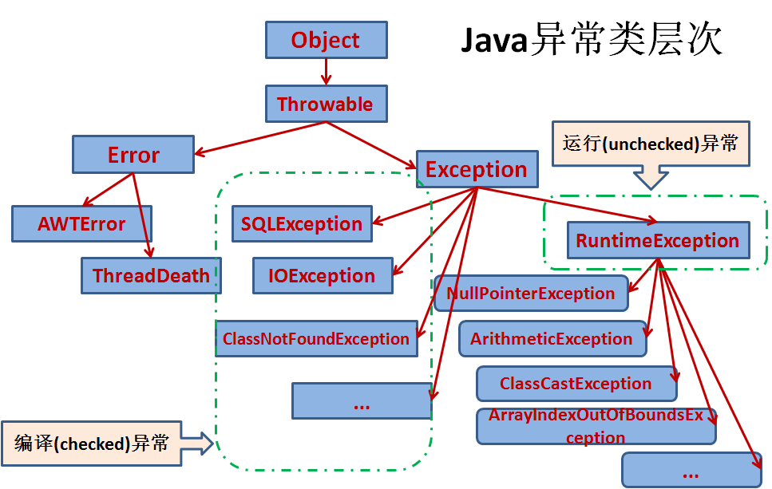

## 异常的层次

java异常大的方面分为两类:

- **Error**:是无法处理的异常，比如OutOfMemoryError，一般发生这种异常，JVM会选择终止程序。因此我们编写程序时不需要关心这类异常。
- **Exception**:也就是我们经常见到的一些异常情况，比如NullPointerException、IndexOutOfBoundsException，这些异常是我们可以处理的异常。

Error 和  Exception都派生于：Throwable

Exception 又分为unchecked exception和checked exception：

- **unchecked exception**（非检查异常），也称运行时异常（RuntimeException），比如常见的NullPointerException、IndexOutOfBoundsException。对于运行时异常，java编译器不要求必须进行异常捕获处理或者抛出声明，由程序员自行决定。
- **checked exception**（检查异常），也称非运行时异常（运行时异常以外的异常就是非运行时异常），java编译器强制程序员必须进行捕获处理，比如常见的IOExeption和SQLException。对于非运行时异常如果不进行捕获或者抛出声明处理，编译都不会通过。

