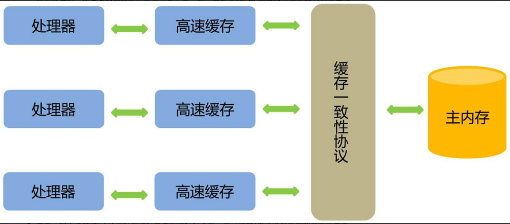

## 介绍

对于可见性，Java提供了volatile关键字来保证**可见性**、**有序性**。**但不保证原子性**。
普通的共享变量不能保证可见性，因为普通共享变量被修改之后，什么时候被写入主存是不确定的，当其他线程去读取时，此时内存中可能还是原来的旧值，因此无法保证可见性。

- volatile关键字对于基本类型的修改可以在随后对多个线程的读保持一致，但是对于引用类型如数组，实体bean，仅仅保证引用的可见性，但并不保证引用内容的可见性。。
- 禁止进行指令重排序。

背景：为了提高处理速度，处理器不直接和内存进行通信，而是先将系统内存的数据读到内部缓存（L1，L2或其他）后再进行操作，但操作完不知道何时会写到内存。

- **如果对声明了volatile的变量进行写操作**，JVM就会向处理器发送一条指令，将这个变量所在缓存行的数据写回到系统内存。但是，就算写回到内存，如果其他处理器缓存的值还是旧的，再执行计算操作就会有问题。
- 在多处理器下，为了保证各个处理器的缓存是一致的，就会**实现缓存一致性协议**，当某个CPU在写数据时，如果发现操作的变量是共享变量，则会通知其他CPU告知该变量的缓存行是无效的，因此其他CPU在读取该变量时，发现其无效会重新从主存中加载数据。

- **总结下来**：
- 第一：使用volatile关键字会强制将修改的值立即写入主存；
- 第二：使用volatile关键字的话，当线程2进行修改时，会导致线程1的工作内存中缓存变量的缓存行无效（反映到硬件层的话，就是CPU的L1或者L2缓存中对应的缓存行无效）；
- 第三：由于线程1的工作内存中缓存变量的缓存行无效，所以线程1再次读取变量的值时会去主存读取。