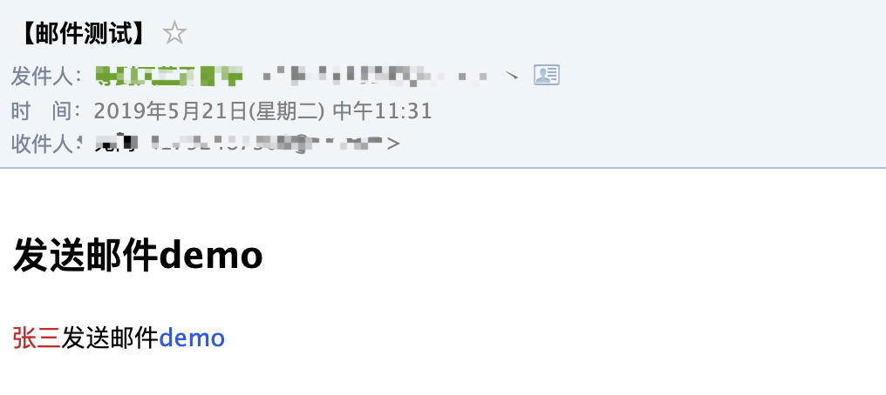
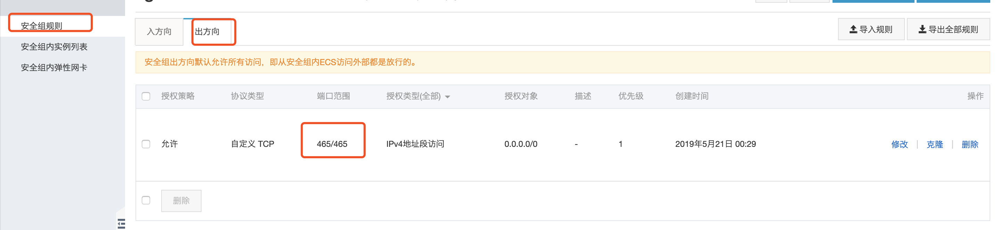

## spring boot 发送邮件

#### 简介

spring boot 已经对发送邮件做了做封装，只需引入spring-boot-starter-mail 即可快速的在springboot项目中实现发送邮件的功能。如果想要发送html文本的邮件，利用freemarker作为模板引擎来实现。下面具体的介绍springboot,freemarker 发送邮件。

#### 发送邮件相关pom

```xml
<dependency>
      <groupId>org.springframework.boot</groupId>
      <artifactId>spring-boot-starter-mail</artifactId>
    </dependency>

    <dependency>
      <groupId>org.springframework.boot</groupId>
      <artifactId>spring-boot-starter-freemarker</artifactId>
    </dependency>
```

#### 邮件服务器开启smtp服务

这一步很重要，只有当发送方的邮件服务器开启了smtp服务，发送方才能将邮件发送出去。

qq邮箱与网易邮箱的开启smtp方法：

<https://www.cnblogs.com/feifeicui/p/8572985.html>

#### 添加配置文件

在springboot 项目中修改application.yml 文件，添加发送邮件相关的配置。

1. 使用stmp的配置

```yml
spring:
  mail:
    default-encoding: utf-8
    host: smtp.163.com
    username: xxxxx@163.com
    password: xxxxxxxxxx  # 授权码
    port: 25
    protocol: smtp
```

2. 使用安全的smtp的配置(smtps)

```yml
spring:
  mail:
    default-encoding: utf-8
    host: smtp.163.com
    username: xxxxx@163.com
    password: xxxxxxxxxx  # 授权码
    port: 25
    protocol: smtps
```


#### 发送邮件方法封装

```java
@Service
@Slf4j
public class MailServiceImpl implements MailService {


  //注入MailSender
  @Autowired
  private JavaMailSender mailSender;

  //发送邮件的模板引擎
  @Autowired
  private FreeMarkerConfigurer configurer;

 	/**
   * 参数
   * @param params 参数
   * @param title 邮件标题
   * @param templateName 模板的名称
   * @param from 发送者
   * @param to 接受者
   */
  @Override
  public void sendMessageMail(Object params, String title, String templateName, String from,
      String to) {

    try {

      MimeMessage mimeMessage = mailSender.createMimeMessage();
      MimeMessageHelper helper = new MimeMessageHelper(mimeMessage, true);
      //发送者
      helper.setFrom(from);
      //发送给谁
      helper.setTo(InternetAddress.parse(to));
      helper.setSubject(
          "【" + title + "】");//邮件标题

      Map<String, Object> model = new HashMap<>();
      model.put("params", params);
      try {
        Template template = configurer.getConfiguration().getTemplate(templateName);
        try {
          String text = FreeMarkerTemplateUtils.processTemplateIntoString(template, model);

          helper.setText(text, true);
          mailSender.send(mimeMessage);
        } catch (TemplateException e) {
          log.error("[MailServiceImpl]-[sendMessageMail] 异常", e);
        }
      } catch (IOException e) {
        e.printStackTrace();
      }
    } catch (MessagingException e) {
      e.printStackTrace();
    }
  }
}

```

在resources/templates 下面创建一个 freemarker 文件 mail.ftl。

```html
<!DOCTYPE html>
<html>
<head>
  <meta charset="UTF-8">
  <title>发送邮件demo</title>
</head>
<body>
<div>
  <h2>发送邮件demo</h2>
  <p>
    <span style="color: #cf1322">${(params.title)!""}</span><span>发送邮件</span><span style="color: #2f54eb">demo</span>
  </p>
</div>
</body>
</html>
```

调用发送文件。

```java

  @Autowired
  private MailProperties mailProperties;

@Test
  public void mailTest(){
    Map<String,Object> map = new HashMap<>();
    map.put("title","张三");
    mailService.sendMessageMail(map, "邮件测试", "mail.ftl", mailProperties.getUsername(),
        "123@qq.com");
  }

```

发送结果



#### 部署到阿里云发送邮件失败

```
org.springframework.mail.MailSendException: Mail server connection failed; nested exception is javax.mail.MessagingException: Could not connect to SMTP host: smtp.qq.com, port: 465, response: -1. Failed messages: javax.mail.MessagingException: Could not connect to SMTP host: smtp.qq.com, port: 465, response: -1
```

需要配置阿里云安全组，开放465 出口权限。

