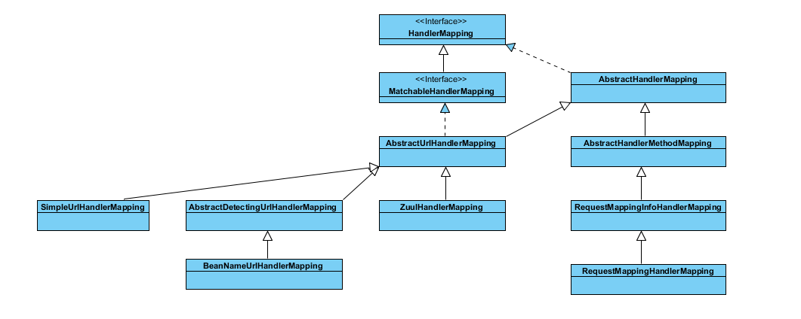
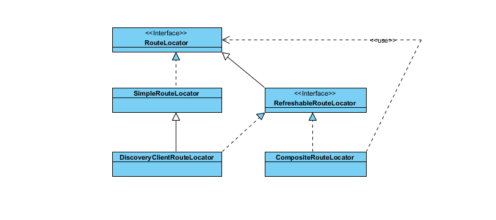
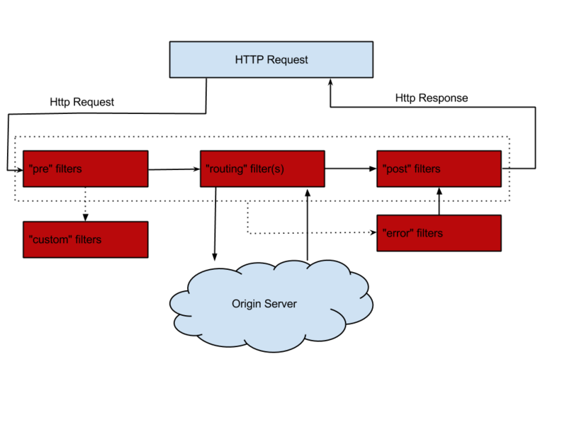
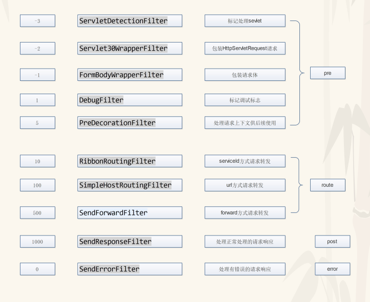

## 路由

zuul 遵从spring mvc 处理流程思想的，HandlerMapping 和HandlerAdapter组件。



在ZuulHandlerMapping中。核心路由代码。

```java
@Override
protected Object lookupHandler(String urlPath, HttpServletRequest request) throws Exception {
 if (this.errorController != null && urlPath.equals(this.errorController.getErrorPath())) {
  return null;
 }
 if (isIgnoredPath(urlPath, this.routeLocator.getIgnoredPaths())) return null;
 RequestContext ctx = RequestContext.getCurrentContext();
 if (ctx.containsKey("forward.to")) {
  return null;
 }
 if (this.dirty) {
  synchronized (this) {
   if (this.dirty) {
    registerHandlers();
    this.dirty = false;
   }
  }
 }
 return super.lookupHandler(urlPath, request);
}

private boolean isIgnoredPath(String urlPath, Collection<String> ignored) {
 if (ignored != null) {
  for (String ignoredPath : ignored) {
   if (this.pathMatcher.match(ignoredPath, urlPath)) {
    return true;
   }
  }
 }
 return false;
}

private void registerHandlers() {
 Collection<Route> routes = this.routeLocator.getRoutes();
 if (routes.isEmpty()) {
  this.logger.warn("No routes found from RouteLocator");
 }
 else {
  for (Route route : routes) {
   registerHandler(route.getFullPath(), this.zuul);
  }
 }
}
```


## 路由定位器 



- SimpleRouteLocator：主要加载配置文件的路由规则
- DiscoveryClientRouteLocator：服务发现的路由定位器，去注册中心如Eureka，consul等拿到服务名称，以这样的方式`/服务名称/**`映射成路由规则
- CompositeRouteLocator：复合路由定位器，主要集成所有的路由定位器（如配置文件路由定位器，服务发现定位器，自定义路由定位器等）来路由定位。
- RefreshableRouteLocator：路由刷新，只有实现了此接口的路由定位器才能被刷新


## zookeeper 服务注册发现

zookeeper做服务的注册与发现，可以将所有的服务都注册到zookeeper，所有的请求都通过网关的时候，网关去zookeeper中获取服务注册的信息，将请求转到响应的服务器上执行。

下面看下zuul怎么利用zookeeper路由到请求服务器上的。

当引入zookeeper-discovery做服务发现的时候，发现集合器中多一个ZookeeperDiscoveryClient，zk的客户端发现

```java
@Bean
	@Primary
	public CompositeDiscoveryClient compositeDiscoveryClient(List<DiscoveryClient> discoveryClients) {
		return new CompositeDiscoveryClient(discoveryClients);
	}
```

DiscoveryClientRouteLocator 注入的时候discovery就是CompositeDiscoveryClient，里面已经包含ZookeeperDiscoveryClient

```java
@Bean
@ConditionalOnMissingBean(DiscoveryClientRouteLocator.class)
public DiscoveryClientRouteLocator discoveryRouteLocator() {
    return new DiscoveryClientRouteLocator(this.server.getServlet().getServletPrefix(), this.discovery, this.zuulProperties,
                                           this.serviceRouteMapper, this.registration);
}
```

最终可以将zookeeper上的service-id添加到路由规则里面：

```java
// Add routes for discovery services by default
List<String> services = this.discovery.getServices();
String[] ignored = this.properties.getIgnoredServices()
    .toArray(new String[0]);
for (String serviceId : services) {
    // Ignore specifically ignored services and those that were manually
    // configured
    String key = "/" + mapRouteToService(serviceId) + "/**";
    if (staticServices.containsKey(serviceId)
        && staticServices.get(serviceId).getUrl() == null) {
        // Explicitly configured with no URL, cannot be ignored
        // all static routes are already in routesMap
        // Update location using serviceId if location is null
        ZuulRoute staticRoute = staticServices.get(serviceId);
        if (!StringUtils.hasText(staticRoute.getLocation())) {
            staticRoute.setLocation(serviceId);
        }
    }
    if (!PatternMatchUtils.simpleMatch(ignored, serviceId)
        && !routesMap.containsKey(key)) {
        // Not ignored
        routesMap.put(key, new ZuulRoute(key, serviceId));
    }
```

最终映射的名字为 /service-id/api/xxxxx。


## 请求处理

处理流程：

1. 第一次请求，routeLocator中获取路由，将路由和handler（ZuulController）注册映射关系
2. lookupHandler 获取上面的路由和handler注册关系。
3. 请求路径和注解的路径pathPattern匹配上了，获取handler，去执行。最终去执行ZuulController的handler方法。
4. ZuulController中handler方法去调用ZuulServlet 的service方法。


```java
@Override
    public void service(javax.servlet.ServletRequest servletRequest, javax.servlet.ServletResponse servletResponse) throws ServletException, IOException {
        try {
            init((HttpServletRequest) servletRequest, (HttpServletResponse) servletResponse);
            RequestContext context = RequestContext.getCurrentContext();
            context.setZuulEngineRan();
            try {
                preRoute();
            } catch (ZuulException e) {
                error(e);
                postRoute();
                return;
            }
            try {
                route();
            } catch (ZuulException e) {
                error(e);
                postRoute();
                return;
            }
            try {
                postRoute();
            } catch (ZuulException e) {
                error(e);
                return;
            }

        } catch (Throwable e) {
            error(new ZuulException(e, 500, "UNHANDLED_EXCEPTION_" + e.getClass().getName()));
        } finally {
            RequestContext.getCurrentContext().unset();
        }
    }
```

这段代码体现了zuul过滤器的生命周期，官方提供了一张图很形象的展示：



zuul把过滤器分为四个阶段，分别是

- pre：主要是在请求路由之前调用，很多验证可以在这里做
- route：在路由请求时候被调用，主要用来转发请求
- post：主要用来处理响应请求
- error：当错误发生时，会经由这个类型的过滤器处理


zuul默认为我们提供了各个阶段的过滤器一共10个



这里我们来着重看下路由阶段的两个过滤器

- SimpleHostRoutingFilter：主要提供当路由设置url方式时，由这个路由器来转发请求，使用的是apache的`CloseableHttpClient`来发送http请求
- RibbonRoutingFilter：当路由设置serviceId时，由此过滤器来转发请求，这里集成了ribbon，Hystrix，实现负载均衡，熔断的功能；默认情况下也是使用apache的`HttpClient`来转发请求

### filter 的注入

在ZuulServerAutoConfiguration中zuul初始化器。ZuulFilterInitializer注入到容器的时候，将全部的filter注入到了FilterRegistry中。FilterRegistry又被FilterLoader引用。最终可以通过FilterLoader对Filter的操作。

```java
@Configuration
protected static class ZuulFilterConfiguration {

    @Autowired
    private Map<String, ZuulFilter> filters;

    @Bean
    public ZuulFilterInitializer zuulFilterInitializer(
        CounterFactory counterFactory, TracerFactory tracerFactory) {
        FilterLoader filterLoader = FilterLoader.getInstance();
        FilterRegistry filterRegistry = FilterRegistry.instance();
        return new ZuulFilterInitializer(this.filters, counterFactory, tracerFactory, filterLoader, filterRegistry);
    }

```

ZuulFilterInitializer的初始化方法。

```java
@PostConstruct
public void contextInitialized() {
    log.info("Starting filter initializer");

    TracerFactory.initialize(tracerFactory);
    CounterFactory.initialize(counterFactory);

    for (Map.Entry<String, ZuulFilter> entry : this.filters.entrySet()) {
        filterRegistry.put(entry.getKey(), entry.getValue());
    }
}
```

### filter执行

上面说过了，过滤器分为pre,route,post,error。也就是在执行的ZuulServlet 的service方法中的四个方法：

-  preRoute();
-  route();
-  postRoute();
-  error(e);


这四个方法最终通过ZuuRunner 调用 FilterProcessor中相应的4个方法，都会去执行runFilters方法：

```java
public void postRoute() throws ZuulException {    
	try {
            runFilters("post");
        } catch (ZuulException e) {
            throw e;
        } catch (Throwable e) {
            throw new ZuulException(e, 500, "UNCAUGHT_EXCEPTION_IN_POST_FILTER_" + e.getClass().getName());
        }
    }

    public void error() {
        try {
            runFilters("error");
        } catch (Throwable e) {
            logger.error(e.getMessage(), e);
        }
    }

    public void route() throws ZuulException {
        try {
            runFilters("route");
        } catch (ZuulException e) {
            throw e;
        } catch (Throwable e) {
            throw new ZuulException(e, 500, "UNCAUGHT_EXCEPTION_IN_ROUTE_FILTER_" + e.getClass().getName());
        }
    }

    public void preRoute() throws ZuulException {
        try {
            runFilters("pre");
        } catch (ZuulException e) {
            throw e;
        } catch (Throwable e) {
            throw new ZuulException(e, 500, "UNCAUGHT_EXCEPTION_IN_PRE_FILTER_" + e.getClass().getName());
        }
    }

    public Object runFilters(String sType) throws Throwable {
        if (RequestContext.getCurrentContext().debugRouting()) {
            Debug.addRoutingDebug("Invoking {" + sType + "} type filters");
        }
        boolean bResult = false;
        // 根据类型获取filters
        List<ZuulFilter> list = FilterLoader.getInstance().getFiltersByType(sType);
        if (list != null) {
            for (int i = 0; i < list.size(); i++) {
                ZuulFilter zuulFilter = list.get(i);
                Object result = processZuulFilter(zuulFilter);
                if (result != null && result instanceof Boolean) {
                    bResult |= ((Boolean) result);
                }
            }
        }
        return bResult;
    }
```

根据类型获取filter代码，上面说过 FilterLoader管理了FilterRegistry，进而管理全部的filters。

```java
 public List<ZuulFilter> getFiltersByType(String filterType) {
     List<ZuulFilter> list = hashFiltersByType.get(filterType);
     if (list != null) return list;

     list = new ArrayList<ZuulFilter>();

     Collection<ZuulFilter> filters = filterRegistry.getAllFilters();
     for (Iterator<ZuulFilter> iterator = filters.iterator(); iterator.hasNext(); ) {
         ZuulFilter filter = iterator.next();
         if (filter.filterType().equals(filterType)) {
             list.add(filter);
         }
     }
     Collections.sort(list); // sort by priority

     hashFiltersByType.putIfAbsent(filterType, list);
     return list;
 }
```

这样就找了相应的filter进行执行。


### RibbonRoutingFilter的执行原理

上面讲到找到了filter执行其run方法。其中RibbonRoutingFilter就是用来执行秦秋第三方服务器的filter，通过该filter可以根据url路由规则找到到对应的服务器，远程调用第三方服务的接口，将返回结果封装。RibbonRoutingFilter 的run方法代码：

```java
@Override
public Object run() {
    RequestContext context = RequestContext.getCurrentContext();
    this.helper.addIgnoredHeaders();
    try {
        RibbonCommandContext commandContext = buildCommandContext(context);
        // forward 就是去调用第三方服务器
        ClientHttpResponse response = forward(commandContext);
        setResponse(response);
        return response;
    }
    catch (ZuulException ex) {
        throw new ZuulRuntimeException(ex);
    }
    catch (Exception ex) {
        throw new ZuulRuntimeException(ex);
    }
}

protected ClientHttpResponse forward(RibbonCommandContext context) throws Exception {
		Map<String, Object> info = this.helper.debug(context.getMethod(),
				context.getUri(), context.getHeaders(), context.getParams(),
				context.getRequestEntity());

        // Ribbon做客户端负载均衡，在调用的时候使用Hystrix做断路保护
		RibbonCommand command = this.ribbonCommandFactory.create(context);
		try {
			ClientHttpResponse response = command.execute();
			this.helper.appendDebug(info, response.getRawStatusCode(), response.getHeaders());
			return response;
		}
		catch (HystrixRuntimeException ex) {
			return handleException(info, ex);
		}

	}
```

Ribbon会从zookeeper上找到服务的ip和端口号。然后在客户端做负载均衡。

以HttpClientRibbonCommand 为例。 RibbonCommand 继承HystrixCommand,重写了run方法。

HttpClientRibbonCommandFactory （抽象工厂模式）中，创建HttpClientRibbonCommand实例：

```java
@Override
	public HttpClientRibbonCommand create(final RibbonCommandContext context) {
		FallbackProvider zuulFallbackProvider = getFallbackProvider(context.getServiceId());
		final String serviceId = context.getServiceId();
		final RibbonLoadBalancingHttpClient client = this.clientFactory.getClient(
				serviceId, RibbonLoadBalancingHttpClient.class);
		client.setLoadBalancer(this.clientFactory.getLoadBalancer(serviceId));

		return new HttpClientRibbonCommand(serviceId, client, context, zuulProperties, zuulFallbackProvider,
				clientFactory.getClientConfig(serviceId));
	}
```

创建HttpClientRibbonCommand实例的时候将RibbonLoadBalancingHttpClient的实例，serviceId以及相关参数传入到HttpClientRibbonCommand赋值给相关属性。

RibbonCommand调用execute你方法时候，run方法执行。run方法源代码如下：

```java
	@Override
	protected ClientHttpResponse run() throws Exception {
		final RequestContext context = RequestContext.getCurrentContext();

		RQ request = createRequest();
		RS response;
		
		boolean retryableClient = this.client instanceof AbstractLoadBalancingClient
				&& ((AbstractLoadBalancingClient)this.client).isClientRetryable((ContextAwareRequest)request);
		
		if (retryableClient) {
            // 调用RibbonLoadBalancingHttpClient的execute方法
			response = this.client.execute(request, config);
		} else {
			response = this.client.executeWithLoadBalancer(request, config);
		}
		context.set("ribbonResponse", response);

		if (this.isResponseTimedOut()) {
			if (response != null) {
				response.close();
			}
		}

		return new RibbonHttpResponse(response);
	}
```

```java
@Override
public RibbonApacheHttpResponse execute(RibbonApacheHttpRequest request,
          final IClientConfig configOverride) throws Exception {
 IClientConfig config = configOverride != null ? configOverride : this.config;
 RibbonProperties ribbon = RibbonProperties.from(config);
 RequestConfig requestConfig = RequestConfig.custom()
   .setConnectTimeout(ribbon.connectTimeout(this.connectTimeout))
   .setSocketTimeout(ribbon.readTimeout(this.readTimeout))
   .setRedirectsEnabled(ribbon.isFollowRedirects(this.followRedirects))
   .build();

 request = getSecureRequest(request, configOverride);
 final HttpUriRequest httpUriRequest = request.toRequest(requestConfig);
  // 交给代理委托对象处理。
 final HttpResponse httpResponse = this.delegate.execute(httpUriRequest);
 return new RibbonApacheHttpResponse(httpResponse, httpUriRequest.getURI());
}
```

在RibbonLoadBalancingHttpClient初始化的时候，创建委托对象。

```java
protected AbstractLoadBalancingClient(IClientConfig config, ServerIntrospector serverIntrospector) {
    super(null);
    this.delegate = createDelegate(config);
    this.config = config;
    this.serverIntrospector = serverIntrospector;
    this.setRetryHandler(RetryHandler.DEFAULT);
    initWithNiwsConfig(config);
}

protected CloseableHttpClient createDelegate(IClientConfig config) {
    RibbonProperties ribbon = RibbonProperties.from(config);
    return HttpClientBuilder.create()
        // already defaults to 0 in builder, so resetting to 0 won't hurt
        .setMaxConnTotal(ribbon.maxTotalConnections(0))
        // already defaults to 0 in builder, so resetting to 0 won't hurt
        .setMaxConnPerRoute(ribbon.maxConnectionsPerHost(0))
        .disableCookieManagement().useSystemProperties() // for proxy
        .build();
}
```

调用http的client发送请求。最终委托给HttpClient发送http请求。