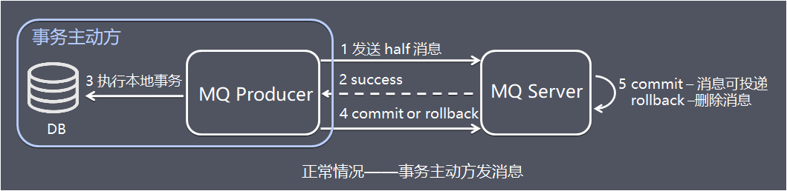
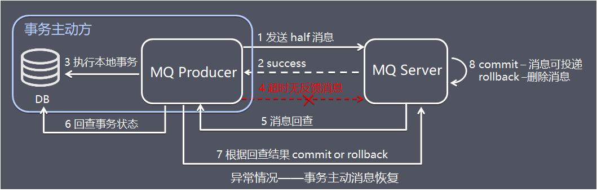
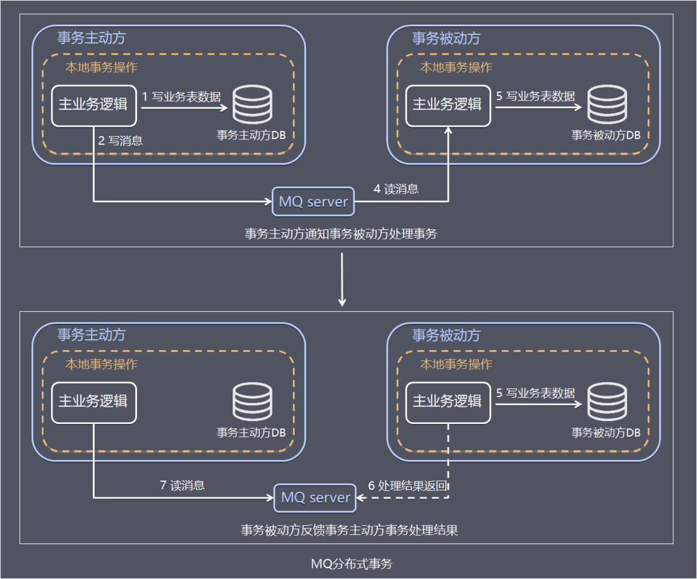

## 方案简介

基于MQ的分布式事务方案其实是对本地消息表的封装，将本地消息表基于MQ 内部，其他方面的协议基本与本地消息表一致。

## 处理流程

下面主要基于RocketMQ4.3之后的版本介绍MQ的分布式事务方案。

在本地消息表方案中，保证事务主动方发写业务表数据和写消息表数据的一致性是基于数据库事务，RocketMQ的事务消息相对于普通MQ，相对于提供了2PC的提交接口，方案如下：

正常情况——事务主动方发消息这种情况下，事务主动方服务正常，没有发生故障，发消息流程如下：

- 图中1、发送方向 MQ服务端(MQ Server)发送**half消息**。
- 图中2、MQ Server 将消息持久化成功之后，向发送方 ACK 确认消息已经发送成功。
- 图中3、发送方开始执行本地事务逻辑。
- 图中4、发送方根据本地事务执行结果向 MQ Server 提交二次确认（commit 或是 rollback）。
- 图中5、MQ Server 收到 commit 状态则将半消息标记为可投递，订阅方最终将收到该消息；MQ Server 收到 rollback 状态则删除半消息，订阅方将不会接受该消息。

异常情况——事务主动方消息恢复在断网或者应用重启等异常情况下，图中4提交的二次确认超时未到达 MQ Server，此时处理逻辑如下：

- 图中5、MQ Server 对该消息发起**消息回查**。
- 图中6、发送方收到消息回查后，需要检查对应消息的本地事务执行的最终结果。
- 图中7、发送方根据检查得到的本地事务的最终状态再次提交二次确认
- 图中8、MQ Server基于commit / rollback 对消息进行投递或者删除

介绍完RocketMQ的事务消息方案后，由于前面已经介绍过本地消息表方案，这里就简单介绍RocketMQ分布式事务：

事务主动方基于MQ通信通知事务被动方处理事务，事务被动方基于MQ返回处理结果。 如果事务被动方消费消息异常，需要不断重试，业务处理逻辑需要保证幂等。 如果是事务被动方业务上的处理失败，可以通过MQ通知事务主动方进行补偿或者事务回滚。

## 方案总结

相比本地消息表方案，MQ事务方案优点是：

- 消息数据独立存储 ，降低业务系统与消息系统之间的耦合。
- 吞吐量由于使用本地消息表方案。

缺点是：

- 一次消息发送需要两次网络请求(half消息 + commit/rollback消息)
- 业务处理服务需要实现消息状态回查接口