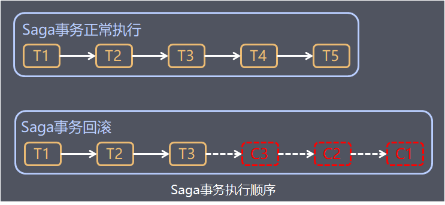
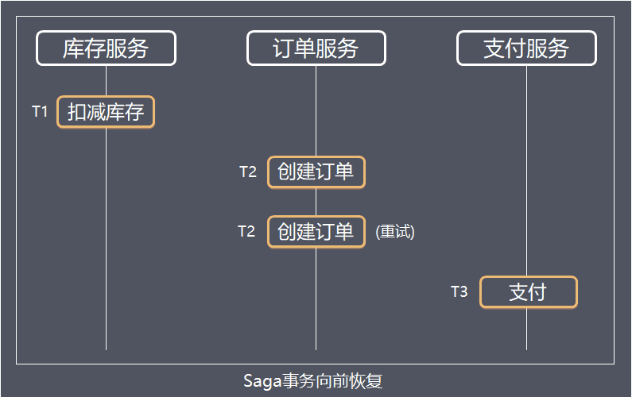
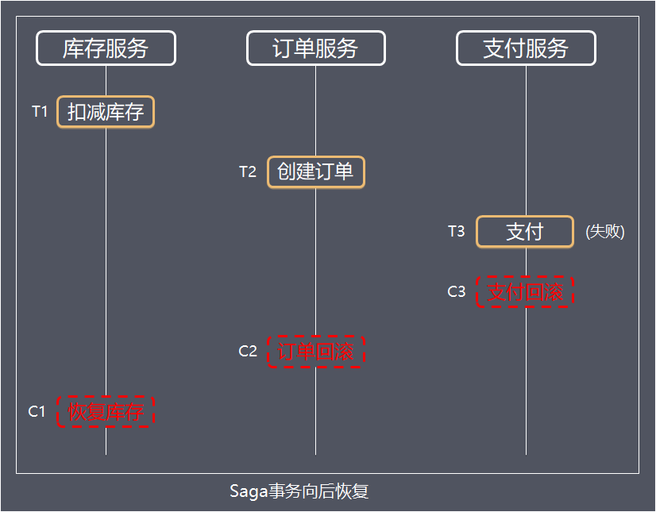
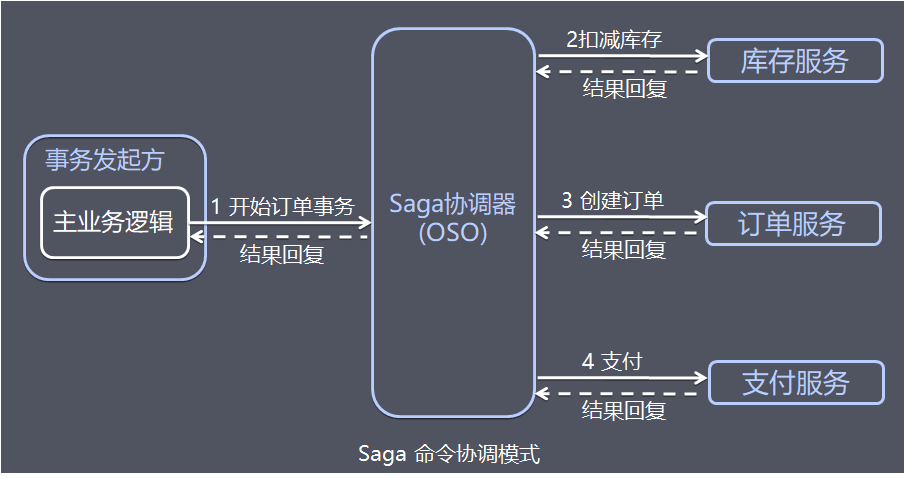
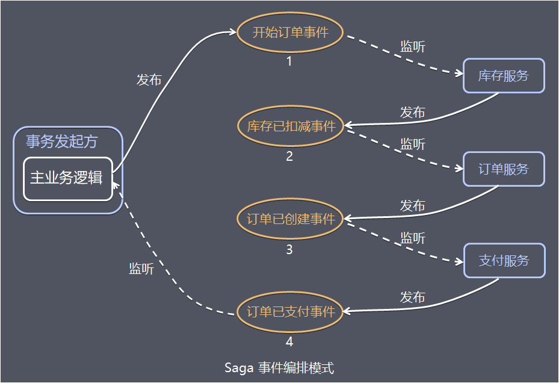

## 方案简介

aga事务源于1987年普林斯顿大学的Hecto和Kenneth发表的如何处理long lived transaction（长活事务）论文，Saga事务核心思想是将长事务拆分为多个本地短事务，由Saga事务协调器协调，如果正常结束那就正常完成，如果某个步骤失败，则根据相反顺序一次调用补偿操作。

## 处理流程

#### Saga事务基本协议如下：

- 每个Saga事务由一系列幂等的有序子事务(sub-transaction) Ti 组成。
- 每个Ti 都有对应的幂等补偿动作Ci，补偿动作用于撤销Ti造成的结果。

可以看到，和TCC相比，Saga没有“预留”动作，它的Ti就是直接提交到库。

下面以下单流程为例，整个操作包括：创建订单、扣减库存、支付、增加积分 Saga的执行顺序有两种：

- 事务正常执行完成 T1, T2, T3, ..., Tn，例如：扣减库存(T1)，创建订单(T2)，支付(T3)，依次有序完成整个事务。
- 事务回滚 T1, T2, ..., Tj, Cj,..., C2, C1，其中0 < j < n，例如：扣减库存(T1)，创建订单(T2)，支付(T3，支付失败)，支付回滚(C3)，订单回滚(C2)，恢复库存(C1)。

#### Saga定义了两种恢复策略：

##### 1.向前恢复(forward recovery)

对应于上面第一种执行顺序，适用于必须要成功的场景，发生失败进行重试，执行顺序是类似于这样的：T1, T2, ..., Tj(失败), Tj(重试),..., Tn，其中j是发生错误的子事务(sub-transaction)。该情况下不需要Ci。

##### 2.向后恢复(backward recovery)

对应于上面提到的第二种执行顺序，其中j是发生错误的子事务(sub-transaction)，这种做法的效果是撤销掉之前所有成功的子事务，使得整个Saga的执行结果撤销。

#### Saga事务常见的有两种不同的实现方式：

##### 1.命令协调(Order Orchestrator)

中央协调器负责集中处理事件的决策和业务逻辑排序。中央协调器（Orchestrator，简称OSO）以命令/回复的方式与每项服务进行通信，全权负责告诉每个参与者该做什么以及什么时候该做什么。

以电商订单的例子为例：

1、事务发起方的主业务逻辑请求OSO服务开启订单事务 

2、OSO向库存服务请求扣减库存，库存服务回复处理结果。 

3、OSO向订单服务请求创建订单，订单服务回复创建结果。 

4、OSO向支付服务请求支付，支付服务回复处理结果。

 5、主业务逻辑接收并处理OSO事务处理结果回复。

中央协调器必须事先知道执行整个订单事务所需的流程(例如通过读取配置)。如果有任何失败，它还负责通过向每个参与者发送命令来撤销之前的操作来协调分布式的回滚。基于中央协调器协调一切时，回滚要容易得多，因为协调器默认是执行正向流程，回滚时只要执行反向流程即可。

##### 2.事件编排 (Event Choreography)

没有中央协调器（没有单点风险）时，每个服务产生并观察其他服务的事件，并决定是否应采取行动 。

行监听，这些服务再执行本地事务并发布（或不发布）新的事件。

当最后一个服务执行本地事务并且不发布任何事件时，意味着分布式事务结束，或者它发布的事件没有被任何Saga参与者听到都意味着事务结束。

以电商订单的例子为例：

1、事务发起方的主业务逻辑发布开始订单事件

 2、库存服务监听开始订单事件，扣减库存，并发布库存已扣减事件 

3、订单服务监听库存已扣减事件，创建订单，并发布订单已创建事件 

4、支付服务监听订单已创建事件，进行支付，并发布订单已支付事件 

5、主业务逻辑监听订单已支付事件并处理。

事件/编排是实现Saga模式的自然方式，它很简单，容易理解，不需要太多的代码来构建。如果事务涉及2至4个步骤，则可能是非常合适的。

## 方案总结

命令协调设计的优点和缺点：优点如下：

- 1、服务之间关系简单，避免服务之间的循环依赖关系，因为Saga协调器会调用Saga参与者，但参与者不会调用协调器
- 2、进程开发简单，只需要执行命令/回复(其实回复消息也是一种事件消息)，降低参与者的复杂性。
- 3、易维护扩展，在添加新步骤时，事务复杂性保持线性，回滚更容易管理，更容易实施和测试

缺点如下：

- 1、中央协调器容易处理逻辑容易过于复杂，导致难以维护。
- 2、存在协调器单点故障风险。

事件/编排设计的优点和缺点优点如下：

- 1、避免中央协调器单点故障风险。
- 2、当涉及的步骤较少服务开发简单，容易实现。

缺点如下：

- 1、服务之间存在循环依赖的风险。
- 2、当涉及的步骤较多，服务间关系混乱，难以追踪调测。

值得补充的是，由于Saga模型中没有Prepare阶段，因此事务间不能保证隔离性，当多个Saga事务操作同一资源时，就会产生更新丢失、脏数据读取等问题，这时需要在业务层控制并发，例如：在应用层面加锁，或者应用层面预先冻结资源。