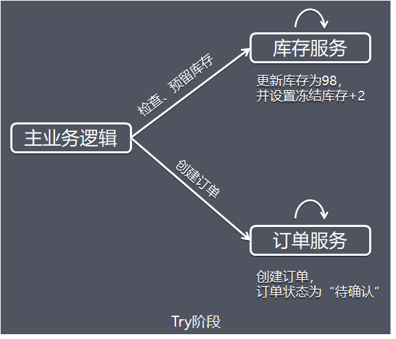
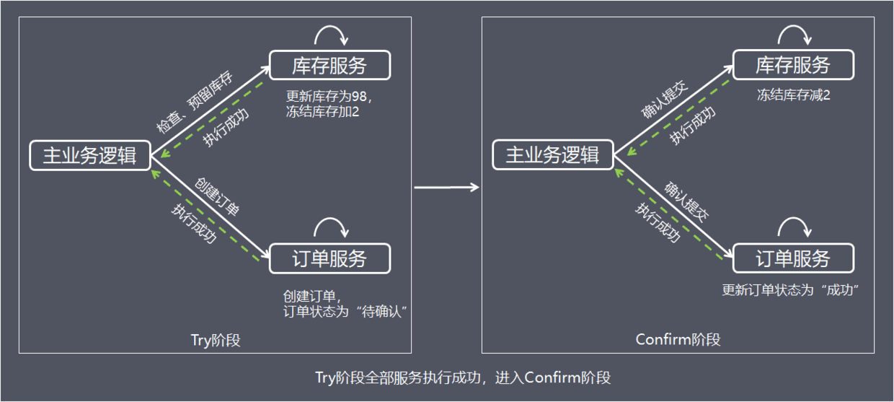
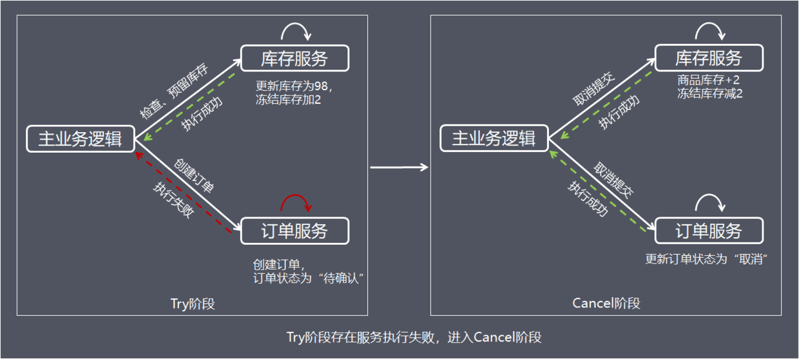

## 方案简介

TCC（Try-Confirm-Cancel）的概念，最早是由Pat Helland于2007年发表的一篇名为《Life beyond Distributed Transactions:an Apostate’s Opinion》的论文提出。

TCC是服务化的二阶段编程模型，其Try、Confirm、Cancel 3个方法均由业务编码实现；

1. Try操作作为一阶段，负责资源的检查和预留。
2. Confirm操作作为二阶段提交操作，执行真正的业务。
3. Cancel是预留资源的取消。

TCC事务的Try、Confirm、Cancel可以理解为SQL事务中的Lock、Commit、Rollback。

## 处理流程

为了方便理解，下面以电商下单为例进行方案解析，这里把整个过程简单分为扣减库存，订单创建2个步骤，库存服务和订单服务分别在不同的服务器节点上。

#### 1. Try 阶段

从执行阶段来看，与传统事务机制中业务逻辑相同。但从业务角度来看，却不一样。TCC机制中的Try仅是一个初步操作，它和后续的确认一起才能真正构成一个完整的业务逻辑，这个阶段主要完成：

- 完成所有业务检查( 一致性 )
- 预留必须业务资源( 准隔离性 )
- Try 尝试执行业务 TCC事务机制以初步操作（Try）为中心的，确认操作（Confirm）和取消操作（Cancel）都是围绕初步操作（Try）而展开。因此，Try阶段中的操作，其保障性是最好的，即使失败，仍然有取消操作（Cancel）可以将其执行结果撤销。

假设商品库存为100，购买数量为2，这里检查和更新库存的同时，冻结用户购买数量的库存，同时创建订单，订单状态为待确认。

#### 2. Confirm / Cancel 阶段

根据Try阶段服务是否全部正常执行，继续执行确认操作（Confirm）或取消操作（Cancel）。 Confirm和Cancel操作满足幂等性，如果Confirm或Cancel操作执行失败，将会不断重试直到执行完成。

##### Confirm：当Try阶段服务全部正常执行， 执行确认业务逻辑操作

这里使用的资源一定是Try阶段预留的业务资源。**在TCC事务机制中认为，如果在Try阶段能正常的预留资源，那Confirm一定能完整正确的提交。Confirm阶段也可以看成是对Try阶段的一个补充，Try+Confirm一起组成了一个完整的业务逻辑。**

##### Cancel：当Try阶段存在服务执行失败， 进入Cancel阶段

Cancel取消执行，释放Try阶段预留的业务资源，上面的例子中，Cancel操作会把冻结的库存释放，并更新订单状态为取消。

## 方案总结

TCC事务机制相对于传统事务机制（X/Open XA），TCC事务机制相比于XA事务机制，有以下优点:

- 性能提升 具体业务来实现控制资源锁的粒度变小，不会锁定整个资源。
- 数据最终一致性 基于Confirm和Cancel的幂等性，保证事务最终完成确认或者取消，保证数据的一致性。
- 可靠性 解决了XA协议的协调者单点故障问题，由主业务方发起并控制整个业务活动，业务活动管理器也变成多点，引入集群。

缺点：

 TCC的Try、Confirm和Cancel操作功能要按具体业务来实现，业务耦合度较高，提高了开发成本。