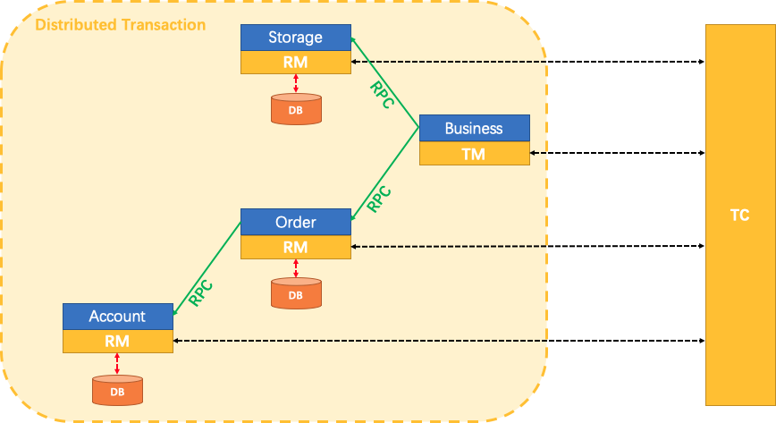

## 介绍

FESCAR有三个基础组件:

- **Transaction Coordinator(TC):** 全局和分支事务的状态的保持，驱动这个全局的提交和回滚.

- **Transaction Manager(TM):** 明确全局事务的范围：开始一个全局事务，提交或者回滚一个全局事务.

- **Resource Manager(RM):** 管理分支事务工作资源，告诉TC，注册这个分支事务和上报分支事务的状态，驱动分支事务的的提交和回滚。

一个典型的FESCAR管理分布式事务的生命周期：

1. TM询问TC开启一个新的全局事务，TC生成一个XID，代表这个全局事务
2. XID 通过微服务的调用链传播
3. RM将本地事务注册为XID到TC的相应全局事务的分支。
4. TM要求TC提交或回滚XID的对应的全局事务。
5. TC驱动整个分支在XID对应的全局事务下，去完成分支的提交或者回滚

## 参考

https://github.com/applenele/fescar-demo

https://www.jianshu.com/p/16b5900bb484

