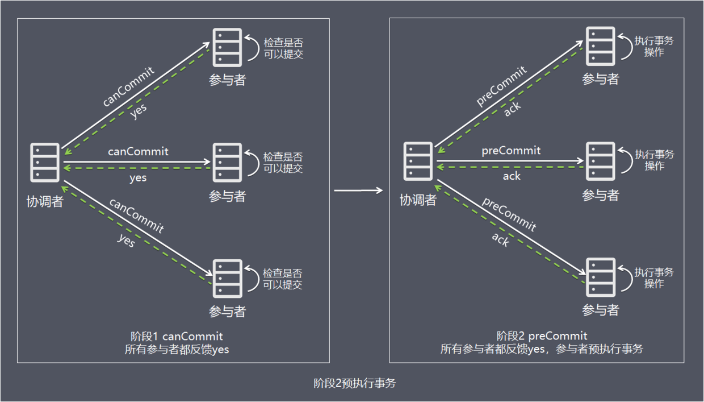
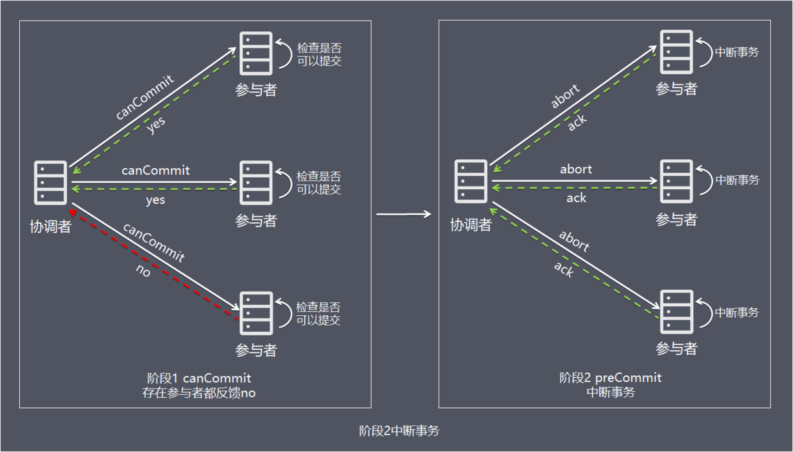
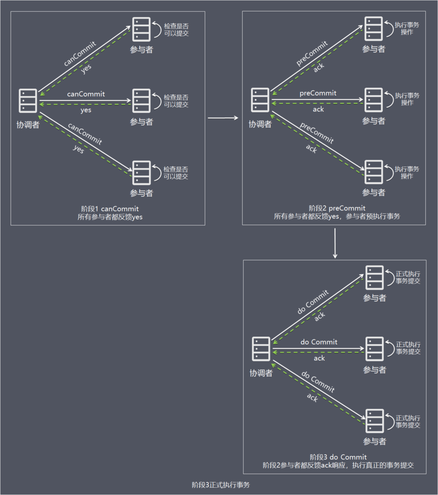
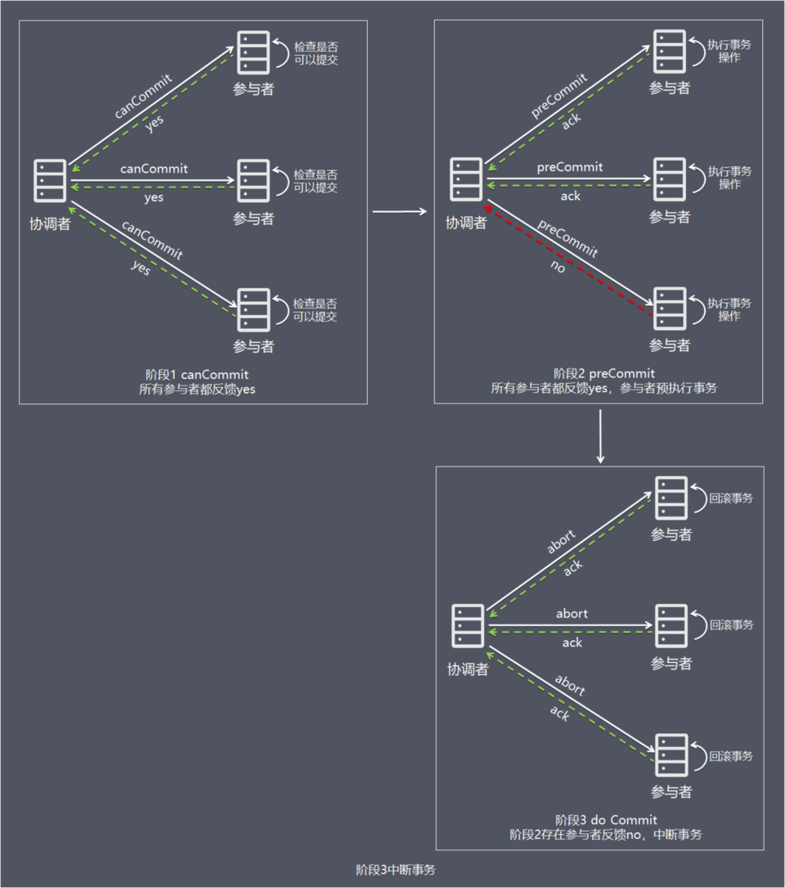

## 3PC(三阶段提交)方案

### 方案简介

三阶段提交协议，是二阶段提交协议的改进版本，与二阶段提交不同的是，**引入超时机制。同时在协调者和参与者中都引入超时机制。**

三阶段提交将二阶段的准备阶段拆分为2个阶段，插入了一个preCommit阶段，使得原先在二阶段提交中，参与者在准备之后，由于协调者发生崩溃或错误，而导致参与者处于无法知晓是否提交或者中止的“不确定状态”所产生的可能相当长的延时的问题得以解决。

### 处理流程

#### 阶段1：

canCommit协调者向参与者发送commit请求，参与者如果可以提交就返回yes响应(参与者不执行事务操作)，否则返回no响应：

- 1、协调者向所有参与者发出包含事务内容的canCommit请求，询问是否可以提交事务，并等待所有参与者答复。
- 2、参与者收到canCommit请求后，如果认为可以执行事务操作，则反馈yes并进入预备状态，否则反馈no。

#### 阶段2：

preCommit协调者根据阶段1 canCommit参与者的反应情况来决定是否可以基于事务的preCommit操作。根据响应情况，有以下两种可能。

##### 情况1：阶段1所有参与者均反馈yes，参与者预执行事务：

1. 协调者向所有参与者发出preCommit请求，进入准备阶段。
2. 参与者收到preCommit请求后，执行事务操作，将undo和redo信息记入事务日志中（但不提交事务）。
3. 各参与者向协调者反馈ack响应或no响应，并等待最终指令。

##### 情况2：阶段1任何一个参与者反馈no，或者等待超时后协调者尚无法收到所有参与者的反馈，即中断事务:

1. 协调者向所有参与者发出abort请求。
2. 无论收到协调者发出的abort请求，或者在等待协调者请求过程中出现超时，参与者均会中断事务。

#### 阶段3：do Commit该阶段进行真正的事务提交，也可以分为以下两种情况：

##### 情况1：阶段2所有参与者均反馈ack响应，执行真正的事务提交：

1. 如果协调者处于工作状态，则向所有参与者发出do Commit请求。
2.  参与者收到do Commit请求后，会正式执行事务提交，并释放整个事务期间占用的资源。
3. 各参与者向协调者反馈ack完成的消息。
4. 协调者收到所有参与者反馈的ack消息后，即完成事务提交。

##### 阶段2任何一个参与者反馈no，或者等待超时后协调者尚无法收到所有参与者的反馈，即中断事务：

1. 如果协调者处于工作状态，向所有参与者发出abort请求。
2. 参与者使用阶段1中的undo信息执行回滚操作，并释放整个事务期间占用的资源。
3. 各参与者向协调者反馈ack完成的消息。
4. 协调者收到所有参与者反馈的ack消息后，即完成事务中断。

注意：进入阶段3后，无论协调者出现问题，或者协调者与参与者网络出现问题，都会导致参与者无法接收到协调者发出的do Commit请求或abort请求。此时，参与者都会在等待超时之后，继续执行事务提交。

### 方案总结

- **优点 ** 相比二阶段提交，三阶段贴近降低了阻塞范围，在等待超时后协调者或参与者会中断事务。避免了协调者单点问题，阶段3中协调者出现问题时，参与者会继续提交事务。
- **缺点** 数据不一致问题依然存在，当在参与者收到preCommit请求后等待do commite指令时，此时如果协调者请求中断事务，而协调者无法与参与者正常通信，会导致参与者继续提交事务，造成数据不一致。

###  