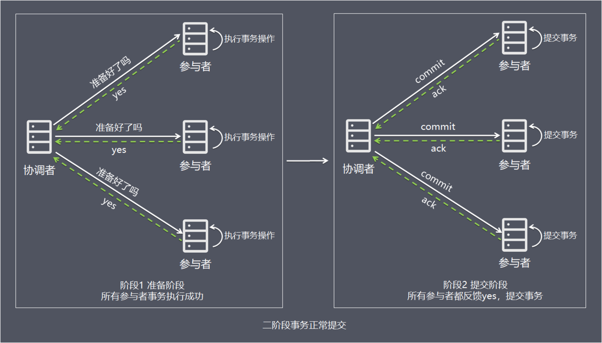
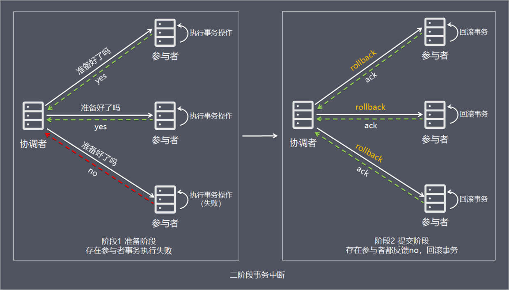

## 二阶段提交

二阶段提交协议（Two-phase Commit，即2PC）是常用的分布式事务解决方案，即将事务的提交过程分为两个阶段来进行处理：准备阶段和提交阶段。事务的发起者称协调者，事务的执行者称参与者。

在分布式系统里，每个节点都可以知晓自己操作的成功或者失败，却无法知道其他节点操作的成功或失败。当一个事务跨多个节点时，为了保持事务的原子性与一致性，而引入一个协调者来统一掌控所有参与者的操作结果，并指示它们是否要把操作结果进行真正的提交或者回滚（rollback）。

二阶段提交的算法思路可以概括为：**参与者将操作成败通知协调者，再由协调者根据所有参与者的反馈情报决定各参与者是否要提交操作还是中止操作**。

核心思想就是对每一个事务都采用先尝试后提交的处理方式，处理后所有的读操作都要能获得最新的数据，因此也可以将二阶段提交看作是一个强一致性算法。

处理流程

简单一点理解，可以把协调者节点比喻为牧师，参与者比喻为新郎新娘，牧师统一协调,新郎新娘各自说I Do。

####  阶段1：准备阶段

>1、协调者向所有参与者发送事务内容，询问是否可以提交事务，并等待所有参与者答复。
>
>2、各参与者执行事务操作，将undo和redo信息记入事务日志中（但不提交事务）。
>
>3、如参与者执行成功，给协调者反馈yes，即可以提交；如执行失败，给协调者反馈no，即不可提交。

#### 阶段2：提交阶段

如果协调者收到了参与者的失败消息或者超时，直接给每个参与者发送回滚(rollback)消息；否则，发送提交(commit)消息；参与者根据协调者的指令执行提交或者回滚操作，释放所有事务处理过程中使用的锁资源。(注意:必须在最后阶段释放锁资源) 接下来分两种情况分别讨论提交阶段的过程。

#### **情况1，当所有参与者均反馈yes，提交事务**：

1. 协调者向所有参与者发出正式提交事务的请求（即commit请求）。
2. 参与者执行commit请求，并释放整个事务期间占用的资源。
3. 各参与者向协调者反馈ack(应答)完成的消息。
4. 协调者收到所有参与者反馈的ack消息后，即完成事务提交。

#### 情况2，当任何阶段1一个参与者反馈no，中断事务：

1. 协调者向所有参与者发出回滚请求（即rollback请求）。

2. 参与者使用阶段1中的undo信息执行回滚操作，并释放整个事务期间占用的资源。

3. 各参与者向协调者反馈ack完成的消息。

4. 协调者收到所有参与者反馈的ack消息后，即完成事务中断。

   

## 方案总结

2PC方案实现起来简单，实际项目中使用比较少，主要因为以下问题：

1. 性能问题 所有参与者在事务提交阶段处于同步阻塞状态，占用系统资源，容易导致性能瓶颈。
2. 可靠性问题 如果协调者存在单点故障问题，如果协调者出现故障，参与者将一直处于锁定状态。
3. 数据一致性问题 在阶段2中，如果发生局部网络问题，一部分事务参与者收到了提交消息，另一部分事务参与者没收到提交消息，那么就导致了节点之间数据的不一致。