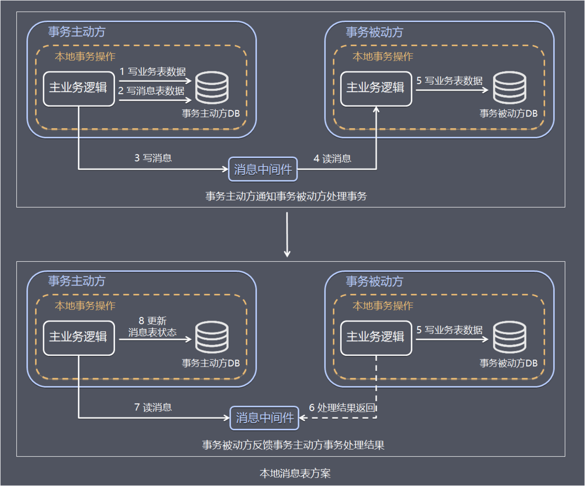

## 方案简介

本地消息表的方案最初是由ebay提出，核心思路是将分布式事务拆分成本地事务进行处理。

方案通过在事务主动发起方额外新建事务消息表，事务发起方处理业务和记录事务消息在本地事务中完成，轮询事务消息表的数据发送事务消息，事务被动方基于消息中间件消费事务消息表中的事务。

这样设计可以避免” **业务处理成功 + 事务消息发送失败** "，或" **业务处理失败 + 事务消息发送成功** "的棘手情况出现，保证2个系统事务的数据一致性。

## 处理流程

下面把分布式事务最先开始处理的事务方成为事务主动方，在事务主动方之后处理的业务内的其他事务成为事务被动方。

为了方便理解，下面继续以电商下单为例进行方案解析，这里把整个过程简单分为扣减库存，订单创建2个步骤，库存服务和订单服务分别在不同的服务器节点上，其中库存服务是事务主动方，订单服务是事务被动方。

事务的主动方需要额外新建事务消息表，用于记录分布式事务的消息的发生、处理状态。

整个业务处理流程如下：

- 步骤1 事务主动方处理本地事务事务主动发在本地事务中处理业务更新操作和写消息表操作。 上面例子中库存服务阶段再本地事务中完成扣减库存和写消息表(图中1、2)。

- 步骤2 事务主动方通过消息中间件，通知事务被动方处理事务通知事务待消息 。 消息中间件可以基于Kafka、RocketMQ消息队列，事务主动方法主动写消息到消息队列，事务消费方消费并处理消息队列中的消息。 上面例子中，库存服务把事务待处理消息写到消息中间件，订单服务消费消息中间件的消息，完成添加订单（图中3 - 5）。
- 步骤3 事务被动方通过消息中间件，通知事务主动方事务已处理的消息。 上面例子中，订单服务把事务已处理消息写到消息中间件，库存服务消费中间件的消息，并将事务消息的状态更新为已完成(图中6 - 8)

为了数据的一致性，当处理错误需要重试，事务发送方和事务接收方相关业务处理需要支持幂等。具体保存一致性的容错处理如下：

1. 当步骤1处理出错，事务回滚，相当于什么都没发生。
2. 当步骤2、步骤3处理出错，由于未处理的事务消息还是保存在事务发送方，事务发送方可以定时轮询为超时消息数据，再次发送的消息中间件进行处理。事务被动方消费事务消息重试处理。
3. 如果是业务上的失败，事务被动方可以发消息给事务主动方进行回滚。
4. 如果多个事务被动方已经消费消息，事务主动方需要回滚事务时需要通知事务被动方回滚。

## 方案总结

方案的优点如下：

- 从应用设计开发的角度实现了消息数据的可靠性，消息数据的可靠性不依赖于消息中间件，弱化了对MQ中间件特性的依赖。
- 方案轻量，容易实现。

缺点如下：

- 与具体的业务场景绑定，耦合性强，不可公用。
- 消息数据与业务数据同库，占用业务系统资源。
- 业务系统在使用关系型数据库的情况下，消息服务性能会受到关系型数据库并发性能的局限。