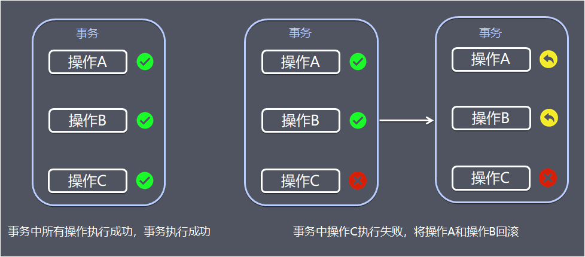
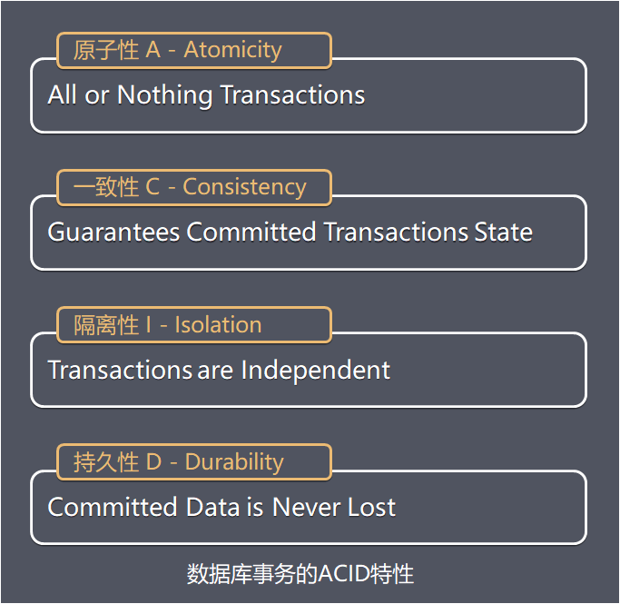

## 事务

事务提供一种机制将一个活动涉及的所有操作纳入到一个不可分割的执行单元，组成事务的所有操作只有在所有操作均能正常执行的情况下方能提交，只要其中任一操作执行失败，都将导致整个事务的回滚。

简单地说，事务提供一种“ **要么什么都不做，要么做全套（All or Nothing）** ”机制。

事务是基于数据进行操作，需要保证事务的数据通常存储在数据库中，所以介绍到事务，就不得不介绍数据库事务的ACID特性，指数据库事务正确执行的四个基本特性的缩写。包含：

1. 原子性(Atomicity)
2. 一致性（Consistency）
3. 隔离性（Isolation）
4. 持久性（Durability）

##  分布式系统

#### cap

分布式系统基本要遵从cap原则。

CAP定理是由加州大学伯克利分校Eric Brewer教授提出来的，他指出WEB服务无法同时满足一下3个属性：

- 一致性(Consistency) ： 客户端知道一系列的操作都会同时发生(生效)
- 可用性(Availability) ： 每个操作都必须以可预期的响应结束
- 分区容错性(Partition tolerance) ： 即使出现单个组件无法可用,操作依然可以完成

具体地讲在分布式系统中，在任何数据库设计中，一个Web应用至多只能同时支持上面的两个属性。显然，任何横向扩展策略都要依赖于数据分区。因此，设计人员必须在一致性与可用性之间做出选择。

#### BASE理论

在分布式系统中，我们往往追求的是可用性，它的重要性比一致性要高，那么如何实现高可用性呢？ 前人已经给我们提出来了另外一个理论，就是BASE理论，它是用来对CAP定理进行进一步扩充的。BASE理论指的是：

- Basically Available（基本可用）
- Soft state（软状态）
- Eventually consistent（最终一致性）

BASE理论是对CAP中的一致性和可用性进行一个权衡的结果，理论的核心思想就是：**我们无法做到强一致，但每个应用都可以根据自身的业务特点，采用适当的方式来使系统达到最终一致性**（Eventual consistency）。

## 分布式事务

> 分布式事务是指会涉及到操作多个数据库的事务。其实就是将对同一库事务的概念扩大到了对多个库的事务。目的是为了保证分布式系统中的数据一致性。分布式事务处理的关键是必须有一种方法可以知道事务在任何地方所做的所有动作，提交或回滚事务的决定必须产生统一的结果（全部提交或全部回滚）

在分布式系统中，各个节点之间在物理上相互独立，通过网络进行沟通和协调。由于存在事务机制，可以保证每个独立节点上的数据操作可以满足ACID。但是，相互独立的节点之间无法准确的知道其他节点中的事务执行情况。所以从理论上讲，两台机器理论上无法达到一致的状态。如果想让分布式部署的多台机器中的数据保持一致性，那么就要保证在所有节点的数据写操作，要不全部都执行，要么全部的都不执行。但是，一台机器在执行本地事务的时候无法知道其他机器中的本地事务的执行结果。所以他也就不知道本次事务到底应该commit还是 roolback。所以，常规的解决办法就是引入一个“协调者”的组件来统一调度所有分布式节点的执行。

## 分布式事务的难点

- **事务的原子性** 事务操作跨不同节点，当多个节点某一节点操作失败时，需要保证多节点操作的**要么什么都不做，要么做全套（All or Nothing）**的原子性。
- **事务的一致性** 当发生网络传输故障或者节点故障，节点间数据复制信道中断，在进行事务操作时需要保证数据一致性，保证事务的任何操作都不会使得数据违反数据库定义的约束、触发器等规则。
- **事务的隔离性** 事务隔离性的本质就是如何正确多个并发事务的处理的读写冲突和写写冲突，因为在分布式事务控制中，可能会出现提交不同步的现象，这个时候就有可能出现“部分已经提交”的事务。此时并发应用访问数据如果没有加以控制，有可能出现“脏读”问题。

## XA规范

X/Open 组织（即现在的 Open Group ）定义了分布式事务处理模型。 X/Open DTP 模型（ 1994 ）包括应用程序（ AP ）、事务管理器（ TM ）、资源管理器（ RM ）、通信资源管理器（ CRM ）四部分。一般，常见的事务管理器（ TM ）是交易中间件，常见的资源管理器（ RM ）是数据库，常见的通信资源管理器（ CRM ）是消息中间件。    通常把一个数据库内部的事务处理，如对多个表的操作，作为本地事务看待。数据库的事务处理对象是本地事务，而分布式事务处理的对象是全局事务。   所谓全局事务，是指分布式事务处理环境中，多个数据库可能需要共同完成一个工作，这个工作即是一个全局事务，例如，一个事务中可能更新几个不同的数据库。对数据库的操作发生在系统的各处但必须全部被提交或回滚。此时一个数据库对自己内部所做操作的提交不仅依赖本身操作是否成功，还要依赖与全局事务相关的其它数据库的操作是否成功，如果任一数据库的任一操作失败，则参与此事务的所有数据库所做的所有操作都必须回滚。     一般情况下，某一数据库无法知道其它数据库在做什么，因此，在一个 DTP 环境中，交易中间件是必需的，由它通知和协调相关数据库的提交或回滚。而一个数据库只将其自己所做的操作（可恢复）影射到全局事务中。    

> XA 就是 X/Open DTP 定义的交易中间件与数据库之间的接口规范（即接口函数），交易中间件用它来通知数据库事务的开始、结束以及提交、回滚等。 XA 接口函数由数据库厂商提供。 
>
> XA中大致分为两部分：事务管理器和本地资源管理器。

**二阶提交协议**和**三阶提交协议**就是根据这一思想衍生出来的。可以说二阶段提交其实就是实现**XA分布式事务**的关键(确切地说：两阶段提交主要保证了分布式事务的原子性：即所有结点要么全做要么全不做)

## 分布式事务方案

1. [分布式事务-两阶段提交](./分布式事务-两阶段提交.md)
2. [分布式事务-三阶段提交](./分布式事务-三阶段提交.md)
3. [分布式事务-TCC](./分布式事务-TCC.md)
4. [分布式事务-本地消息表(最终一致性)](./分布式事务-本地消息表(最终一致性).md)
5. [分布式事务-MQ事务(最终一致性)](./分布式事务-MQ事务(最终一致性).md)
6. [分布式事务-Saga事务(最终一致性)](./分布式事务-Saga事务(最终一致性).md)

## 各方案使用场景

介绍完分布式事务相关理论和常见解决方案后，最终的目的在实际项目中运用，因此，总结一下各个方案的常见的使用场景。

- 2PC/3PC 依赖于数据库，能够很好的提供强一致性和强事务性，但相对来说延迟比较高，比较适合传统的单体应用，在同一个方法中存在跨库操作的情况，不适合高并发和高性能要求的场景。
- TCC 适用于执行时间确定且较短，实时性要求高，对数据一致性要求高，比如互联网金融企业最核心的三个服务：交易、支付、账务。
- 本地消息表/MQ事务 都适用于事务中参与方支持操作幂等，对一致性要求不高，业务上能容忍数据不一致到一个人工检查周期，事务涉及的参与方、参与环节较少，业务上有对账/校验系统兜底。
- Saga事务 由于Saga事务不能保证隔离性，需要在业务层控制并发，适合于业务场景事务并发操作同一资源较少的情况。 Saga相比缺少预提交动作，导致补偿动作的实现比较麻烦，例如业务是发送短信，补偿动作则得再发送一次短信说明撤销，用户体验比较差。Saga事务较适用于补偿动作容易处理的场景。

## 参考

https://www.hollischuang.com/archives/681

https://www.imuo.com/a/636e8a6365dce869e7104af30d3e8e2a95d028b08985e27938d723fc2e66ee21

