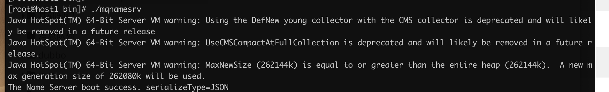

## 快速开始

1. 下载rocketmq文件
2. 解压
3. 修改启动参数

runserver.sh  修改java_opt 改下虚拟机内存

```shell
JAVA_OPT="${JAVA_OPT} -server -Xms256m -Xmx256m -Xmn256m -XX:MetaspaceSize=128m -XX:MaxMetaspaceSize=320m"
```

runbroker.sh修改java_opt 改下虚拟机内存

```shell
JAVA_OPT="${JAVA_OPT} -server -Xms256m -Xmx256m -Xmn256"
```


4. 启动nameserver

```shell
nohup ./mqnamesrv &
```



5. 启动broker(master)

```shell
nohup sh mqbroker -n "127.0.0.1:9876" -c ../conf/2m-noslave/broker-a.properties > broker.out & 
```

