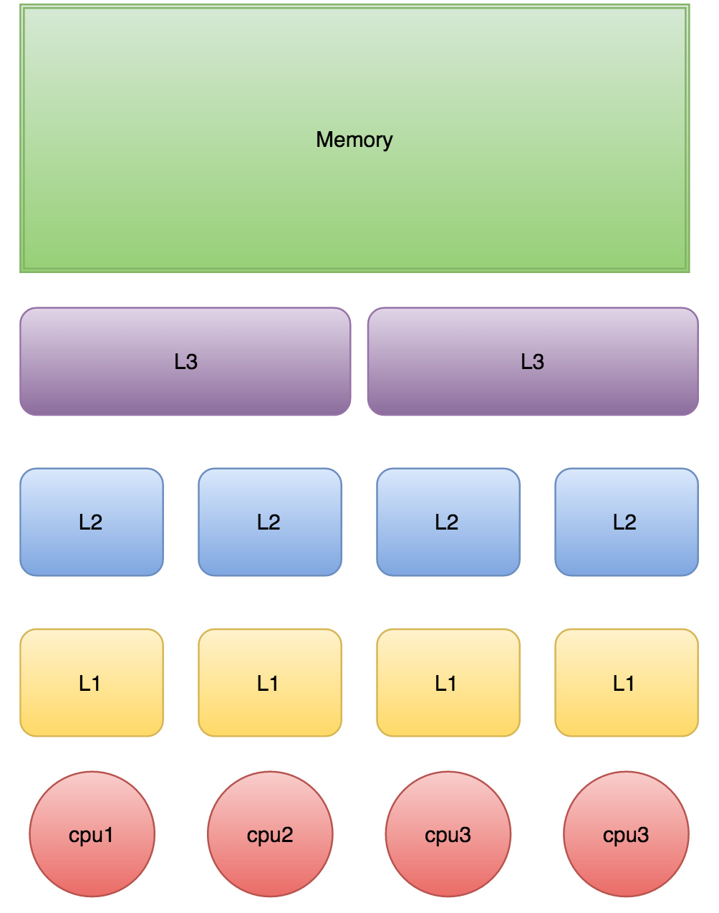

## 共享

下图是计算的基本结构。L1、L2、L3分别表示一级缓存、二级缓存、三级缓存，越靠近CPU的缓存，速度越快，容量也越小。所以L1缓存很小但很快，并且紧靠着在使用它的CPU内核；L2大一些，也慢一些，并且仍然只能被一个单独的CPU核使用；L3更大、更慢，并且被单个插槽上的所有CPU核共享；最后是主存，由全部插槽上的所有CPU核共享。



当CPU执行运算的时候，它先去L1查找所需的数据、再去L2、然后是L3，如果最后这些缓存中都没有，所需的数据就要去主内存拿。走得越远，运算耗费的时间就越长。所以如果你在做一些很频繁的事，你要尽量确保数据在L1缓存中。

另外，线程之间共享一份数据的时候，需要一个线程把数据写回主存，而另一个线程访问主存中相应的数据。

下面是从CPU访问不同层级数据的时间概念:

|                                          |                   |                |
| ---------------------------------------- | ----------------- | -------------- |
| 从CPU到                                  | 大约需要的CPU周期 | 大约需要的时间 |
| 主存                                     |                   | 约60-80ns      |
| QPI 总线传输(between sockets, not drawn) |                   | 约20ns         |
| L3 cache                                 | 约40-45 cycles    | 约15ns         |
| L2 cache                                 | 约10 cycles       | 约3ns          |
| L1 cache                                 | 约3-4 cycles      | 约1ns          |
| 寄存器                                   | 1 cycle           |                |

可见CPU读取主存中的数据会比从L1中读取慢了近2个数量级。


## 缓存行

Cache是由很多个cache line组成的。每个cache line通常是64字节，并且它有效地引用主内存中的一块儿地址。一个Java的long类型变量是8字节，因此在一个缓存行中可以存8个long类型的变量。

CPU每次从主存中拉取数据时，会把相邻的数据也存入同一个cache line。

在访问一个long数组的时候，如果数组中的一个值被加载到缓存中，它会自动加载另外7个。因此你能非常快的遍历这个数组。事实上，你可以非常快速的遍历在连续内存块中分配的任意数据结构。

下面的例子是测试利用cache line的特性和不利用cache line的特性的效果对比。

```java
package com.meituan.FalseSharing;
 

public class CacheLineEffect {
    //考虑一般缓存行大小是64字节，一个 long 类型占8字节
    static  long[][] arr;
 
    public static void main(String[] args) {
        arr = new long[1024 * 1024][];
        for (int i = 0; i < 1024 * 1024; i++) {
            arr[i] = new long[8];
            for (int j = 0; j < 8; j++) {
                arr[i][j] = 0L;
            }
        }
        long sum = 0L;
        long marked = System.currentTimeMillis();
        for (int i = 0; i < 1024 * 1024; i+=1) {
            for(int j =0; j< 8;j++){
                sum = arr[i][j];
            }
        }
        System.out.println("Loop times:" + (System.currentTimeMillis() - marked) + "ms");
 
        marked = System.currentTimeMillis();
        for (int i = 0; i < 8; i+=1) {
            for(int j =0; j< 1024 * 1024;j++){
                sum = arr[j][i];
            }
        }
        System.out.println("Loop times:" + (System.currentTimeMillis() - marked) + "ms");
    }
}
```

在2G Hz、2核、8G内存的运行环境中测试，速度差一倍。


## 参考

https://tech.meituan.com/2016/11/18/disruptor.html